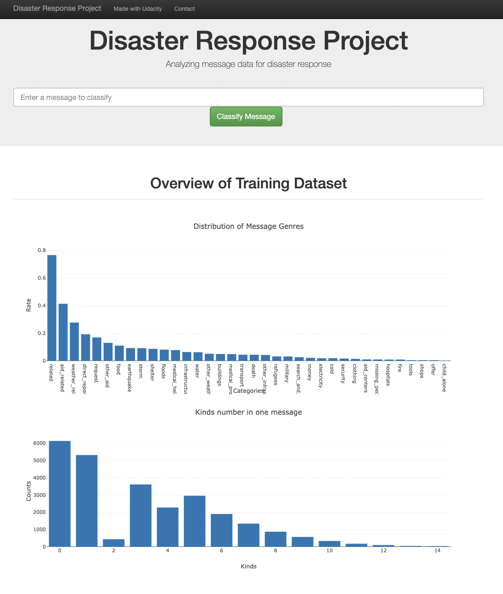

# Disaster Response Pipeline Project
Udacity Data Scientist Project

## Table of Contents
1. Poject Motivation
2. Installation
3. Running the Web App
4. File Descriptions
5. Results
6. Acknowledgements

## Project Motivation
This is a program for Udacity's nanodegree of Data Scientist.

This project will classify categories of disaster messages and display them on a web app.

Understanding the messages sent in a disaster is important for rescue efforts. Being able to automate the categorization of those messages through machine learning can help in understanding the nature of the rescue.

In this project, we will use a dataset of messages sent out during a disaster to build a classifier to identify events that require rescue.

The data loading, cleaning, model building, and evaluation will be pipelined to automate the model building procedure.

The built model will be published as a web app, which will parse the messages input from the site and perform classification.

Supported languages are English only.

The web app look like below.

## Installaion
You need Python3 and these libralies.
* matplotlib
* nltk
* numpy
* pandas
* scipy
* sklearn
* sqlalchemy
* tqdm

## Running the Web App
Run the following commands in the project's root directory to set up your database and model.

To run ETL pipeline that cleans data and stores in database python: data/process_data.py data/disaster_messages.csv data/disaster_categories.csv data/DisasterResponse.db

To run ML pipeline that trains classifier and saves python models/train_classifier.py data/DisasterResponse.db models/classifier.pkl

Run the following command in the app's directory to run your web app python run.py

Go to http://0.0.0.0:3001/

## File Descriptions
* notebook/ETL Pipeline Preparation.ipynb
  * ETL pipeline working at notebook
* notebook/ML Pipeline Preparation.ipynb
  * Machine learning working at notebook
* app/run.py
  * main script of web app
* app/templates/*.html
  * html templates of web app
* data/DisasterResponse.db
  * database of disaster response
* data/disaster_categories.csv
  * raw data of disaster categories
* data/disaster_messages.csv
  * raw data of disaster messages
* data/process_data.py
  * ETL pipeline
* models/classifier.pkl
  * trained model
* models/train_classifier.py
  * train script

## Results
* [accuracy]
  * mean : 0.95
  * min : 0.77 (aid_related)
  * max : 1.00 (child_alone)
  * mean : 0.95

* [f1]
  * mean : 0.93
  * min : 0.77 (aid_related)
  * max : 1.00 (child_alone)
  * mean : 0.93

* [precision]
  * mean : 0.93
  * min : 0.77 (aid_related)
  * max : 1.00 (child_alone)
  * mean : 0.93

* [recall]
  * mean : 0.95
  * min : 0.77 (aid_related)
  * max : 1.00 (child_alone)

## Acknowledgements
The disaster message data was from [Figure Eight](https://www.figure-eight.com/).
